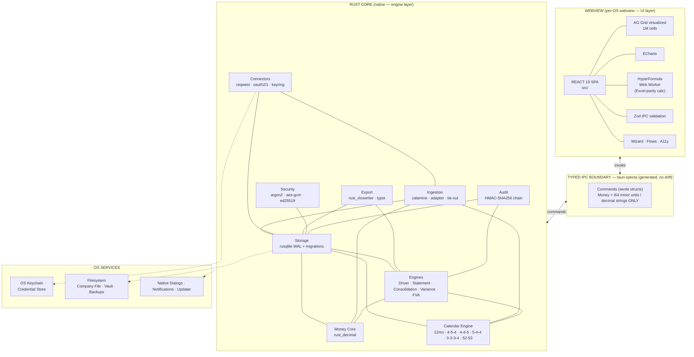
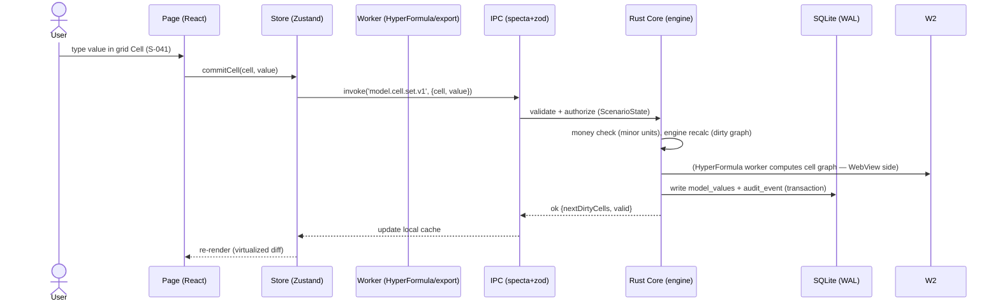

# ARCHITECTURE.md

> OneFP&A · v1.0.0 · Terms per GLOSSARY.md · **System diagram (Mermaid) + exact folder tree + data flow description.** One owner per concern (B14), typed IPC (tauri-specta), money never floats (I1).

---

## 1. SYSTEM ARCHITECTURE



**Invariants enforced at the IPC boundary:** (a) all Money Values cross as `i64` minor units or decimal strings; (b) every input is schema-validated (Zod) + typed (serde + specta); (c) every command writes an Audit event; (d) no command mutates without a Snapshot policy (imports/restores/migrations).

---

## 2. REPOSITORY FOLDER TREE (exact)

```text
fpa/
├── docs/                      # The 54 docs/ specs (DOCS-INDEX.md = master index). Off-index docs forbidden (B8)
├── src/                       # TypeScript UI (webview)
│   ├── main.tsx / App.tsx
│   ├── router.tsx             # routes per SCREENS-SPEC
│   ├── components/
│   │   ├── ui/                # primitives per COMPONENT-LIBRARY
│   │   └── domain/            # financial components (MoneyCell, TieOutPanel…)
│   ├── pages/                 # one dir per screen ID (s001-unlock/, s041-grid/…)
│   ├── stores/                # Zustand stores (STATE-MANAGEMENT.md)
│   ├── workers/               # formula.worker.ts (HyperFormula), export.worker.ts
│   ├── api/                   # generated tauri-specta client + zod gates
│   ├── hooks/                 # data hooks (useModel, useScenario…)
│   ├── theme/                 # tokens.ts (DESIGN-SYSTEM tokens)
│   ├── i18n/                  # en.json (+ locale-format helpers)
│   └── utils/                 # moneyFormat (decimal.js display only)
├── src-tauri/
│   ├── Cargo.toml / Cargo.lock
│   ├── tauri.conf.json        # window, capabilities, updater config
│   ├── capabilities/default.json   # least-privilege (reference issue #0005 fixed: no broad FS)
│   ├── migrations/            # 001_initial.sql … (versioned, tested)
│   └── src/
│       ├── main.rs / lib.rs   # plugin setup, command registration
│       ├── commands/          # IPC command handlers (thin, validate → core)
│       ├── core/
│       │   ├── money.rs       # Money Value (rust_decimal) — sole money owner
│       │   ├── calendar.rs    # Fiscal Calendar engine — sole calendar owner
│       │   ├── formula.rs     # HyperFormula bridge (grid ↔ cells)
│       │   ├── ingestion.rs   # parse/normalize/map/tieout/commit
│       │   ├── engines/       # statements.rs consolidation.rs variance.rs fva.rs health.rs
│       │   ├── connectors/    # qbo.rs xero.rs netsuite.rs sage.rs + adapter.rs
│       │   ├── export/        # xlsx.rs pdf.rs (typst) dump.rs dataroom.rs
│       │   ├── security/      # pin.rs (argon2) crypto.rs (aes-gcm) license.rs (ed25519)
│       │   ├── audit.rs       # HMAC chain
│       │   ├── storage/       # db.rs migrations.rs repositories/*
│       │   └── error.rs       # AppError → IPC error codes (ERROR-HANDLING.md)
├── packs/                     # Industry Packs (DATA ONLY — B15)
│   ├── schema/                # pack.schema.json (validated at load)
│   └── saas/ manufacturing/ retail/ healthcare/ construction/ professional-services/
│       nonprofit/ government/ energy/ financial-services/ logistics/ real-estate/
├── e2e/                       # Playwright + tauri-driver (3 OS)
├── scripts/                   # build/sign/verify/license-check/fixtures (bash+pwsh+py)
├── docs-index.json            # auto-generated; off-index = CI failure (B8)
└── package.json / Cargo.toml  # workspace root
```

---

## 3. DATA FLOW (primary — user action to persisted state)



**Secondary flows:** Ingestion (`file → calamine → normalize → map → tie-out → batch commit → engine recalc → variance ready`); Consolidation (`BU data → rollup maps → eliminations → FX → group statements → tie-out gate`); Export (`layout → engine values → xlsx/typst → file + audit`).

## 4. ENGINE CONTRACT (each engine: pure, idempotent, deterministic)

| Engine | Input | Output | Determinism proof |
|---|---|---|---|
| Calendar | `calendarConfig, fy` | periods, transitive maps | Oracle suite vs published calendars (4-5-4/52-53) |
| Statement | accounts, values, period scope | P&L/BS/CF/SoCE | Tie-out properties (BS tie, CF ties cash) — property-tested |
| Consolidation | BUs, ic_lines, fx_rates, rollup maps | group statements + segments | IC sum zero after elimination (property), BS tie |
| Variance | two versions + attribution inputs | variance + decomposition | Sum of parts = total (property) |
| FVA | forecast versions vs actuals | MAPE/bias/hit | Recomputable from stored versions |
| Health | model state | findings list | No auto-fix; findings reproducible |
| Money | any decimal string | `i64` minor units | Parse/format round-trip property (proptest) |

**Worker split:** HyperFormula (formula graph) runs in the webview worker; all engine-heavy work (consolidation, import, export) runs in Rust (async Tokio) — never blocking the UI.

---

## 5. QUALITY & GUARDRAIL RULES (architecture-level)

1. UI never queries DB directly; SQLite is Rust-only (B4/B14).
2. Money arithmetic in Rust only; decimal.js is display-only (I1).
3. No state duplicated across stores without a documented owner (STATE-MANAGEMENT.md).
4. All IPC commands are backward-compatible via versioned command names (`model.cell.set.v1`).
5. Every engine has deterministic tests + at least one property test (TESTING-STRATEGY.md).
6. Feature flags/labels: `pack`, `bu`, `scenario` identifiers are UUIDs (v4) — never user-typed strings as keys.

*Referenced by: TECH-STACK.md, DATABASE-SCHEMA.md, STATE-MANAGEMENT.md, CODING-STANDARDS.md, CLAUDE.md.*
