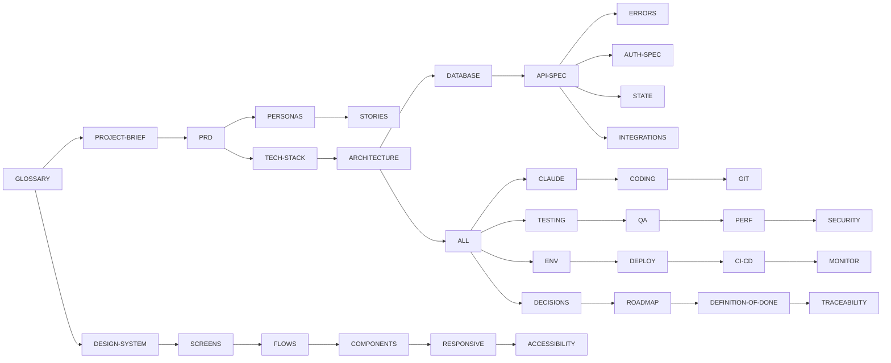

# DOCS-INDEX.md

> OneFP&A · **Master index of all documents with 1-line summary + dependency map.** Off-index docs are forbidden (B8) — adding a doc = adding it here. Generated/verified by `scripts/docs-index.mjs` in CI.

---

## MASTER INDEX (54 docs/ specs + root README = 55 files; ZC revision: born 2026-08-30 with 16 supplemental docs closing the audit gaps — 15 specs + ZERO-COMPROMISE-RULES.md)

| # | File | One-line summary | Depends on |
|---|---|---|---|
| 1 | `GLOSSARY.md` | Locked terminology (12 sections, ~150 terms, 10 invariants, BANNED synonyms) | — |
| 2 | `PROJECT-BRIEF.md` | Problem/solution/pitch/why-now + success metrics + non-goals | 1 |
| 3 | `PRD.md` | 38 MVP + 29 V2 + 6 FUT features, tags, NOT BUILDING, dependency map | 1, 2 |
| 4 | `USER-PERSONAS.md` | Ravi (manufacturer), Priya (group CFO), Alex (SaaS founder) — goals/device/skill | 3 |
| 5 | `USER-STORIES.md` | US-001…US-039 Given/When/Then + 78 edge cases, P0–P3 | 3, 4 |
| 6 | `DESIGN-SYSTEM.md` | Exact hex/fonts/spacing/radii/motion + component styles (light+dark) | 1 |
| 7 | `SCREENS-SPEC.md` | 42 screens + 10 dialogs: route, purpose, elements, all 5 states | 3, 6 |
| 8 | `USER-FLOWS.md` | 14 journeys with failure/recovery branches (UF-001…UF-014) | 5, 7 |
| 9 | `COMPONENT-LIBRARY.md` | ~35 components: props tables, variants, usage rules | 6, 7 |
| 10 | `RESPONSIVE-DESIGN.md` | Breakpoints 900/1280, min 960×640, density, OS DPI, multi-monitor | 6 |
| 11 | `ACCESSIBILITY.md` | WCAG 2.2 AA: contrast, focus, ARIA maps, shortcuts, blocking gates | 6, 7 |
| 12 | `TECH-STACK.md` | Exact packages/versions + why + rejected alternatives + version policy | 1 |
| 13 | `ARCHITECTURE.md` | Mermaid system + data flow + exact folder tree + engine contracts | 12 |
| 14 | `DATABASE-SCHEMA.md` | 33 tables: types/PK/FK/constraints/indexes + example row each | 13 |
| 15 | `API-SPEC.md` | ~70 typed IPC commands incl. 4 detailed specs + error code index | 14, 31 |
| 16 | `AUTH-SPEC.md` | Local auth: PIN/recovery/lock/license flows + permission matrix | 13, 14 |
| 17 | `STATE-MANAGEMENT.md` | State table (scope/storage/invalidation) + race rules | 13, 15 |
| 18 | `INTEGRATIONS.md` | 11 integrations: purpose/secrets/rate-limits/fallbacks | 13, 16 |
| 19 | `ERROR-HANDLING.md` | Canonical error JSON + ~75-code taxonomy + UI rules | 15 |
| 20 | `CLAUDE.md` | Coding-AI context: DO/DON'T/forbidden patterns/response format | 1–19 |
| 21 | `CODING-STANDARDS.md` | Naming, imports, async patterns, templates, review checklist | 20 |
| 22 | `GIT-STANDARDS.md` | Commits/branches/PR rules/release tags | 21 |
| 23 | `TESTING-STRATEGY.md` | Unit/integration/E2E/property/oracle + numeric coverage targets | 12, 19 |
| 24 | `QA-CHECKLIST.md` | Q1–Q8 + 38 feature checklists (8 each) + release gates | 5, 7, 23 |
| 25 | `PERFORMANCE-REQUIREMENTS.md` | Numeric only: startup/recalc/import/consolidation/export budgets | 13, 23 |
| 26 | `SECURITY-CHECKLIST.md` | Threat model + OWASP 10 mapping + local controls + sign-off | 16, 19 |
| 27 | `ENV-VARIABLES.md` | No runtime .env; CI secrets + in-app config tables | 18, 20 |
| 28 | `DEPLOYMENT.md` | Packaging/signing/distribution/enterprise modes/release steps | 12, 27 |
| 29 | `CI-CD.md` | 12-stage pipeline w/ exact commands, triggers, merge gates | 22, 23, 27 |
| 30 | `MONITORING.md` | Local observability + release-infra monitoring + alert thresholds | 24, 26 |
| 31 | `README.md` (root) | <5-min quickstart + 60-second product path | 3, 12 |
| 32 | `CHANGELOG.md` | Keep-a-changelog; v0.1.0 initial entry | 31 |
| 33 | `TODO.md` | Actionable tasks by milestone (M0–M7) + V2 backlog | 35 |
| 34 | `KNOWN-ISSUES.md` | KI-001…KI-013: severity/status/plan + entry template | 3, 19 |
| 35 | `DECISIONS.md` | A1–A22 assumptions + 22 ADRs + superseded record | 1–34 |
| 36 | `ROADMAP.md` | Dependency-ordered milestones w/ complexity + reference docs | 35 |
| 37 | `DEFINITION-OF-DONE.md` | Feature/release doneness checklist + traps | 24, 36 |
| 38 | `FEATURE-TRACEABILITY-MATRIX.md` | Stage 3 audit: feature ↔ story ↔ screens ↔ commands ↔ tables ↔ tests | 3–36 |
| 39 | `INDUSTRY-PACK-SPEC.md` | Pack schema v1: COA/KPI/Driver/Layout/GL/rollup definitions + validation + 12-pack inventory | 3, 14 |
| 40 | `FORMULA-ENGINE-SPEC.md` | Supported function set, Analysis Functions, error values, recalc/cycle policy | 3, 14, 24 |
| 41 | `MONEY-ROUNDING-SPEC.md` | Money representation, rounding modes, largest-remainder algorithm, sign conventions | 12, 14, 40 |
| 42 | `MODELING-METHODS-SPEC.md` | Exact semantics of 7 Planning Methods, spreading, bootstrap, driver grammar | 3, 40, 41 |
| 43 | `SCENARIO-VERSION-SPEC.md` | Scenario state machine, Version rules, Baseline/freeze, compare semantics | 3, 17, 42 |
| 44 | `GL-TEMPLATE-SPEC.md` | Canonical GL Dump columns/signs/sub-sheets + error handling (any-ERP import) | 3, 18, 19 |
| 45 | `CONNECTOR-DATA-DICTIONARY.md` | Per-provider endpoints/fields/scopes + normalization to GL Template | 18, 44 |
| 46 | `EXPORT-FORMAT-SPEC.md` | xlsx/PDF/Model Dump/Data-Room/Board Pack output contracts + injection guard | 3, 41, 43 |
| 47 | `TEST-FIXTURES-SPEC.md` | Deterministic fixture inventory + oracle expected values (calendar/statements/consolidation) | 23, 45 |
| 48 | `LOCALIZATION-SPEC.md` | Locale number/date/currency rules, i18n readiness, V2 RTL | 6, 44 |
| 49 | `COMPLIANCE-DATA-SOVEREIGNTY.md` | Privacy/data-sovereignty guarantees, no-PHI posture, enterprise artifacts | 26, 30 |
| 50 | `SECURITY-INCIDENT-RESPONSE.md` | Incident tiers/SLA/runbook/post-incident + disclosure policy | 26, 30 |
| 51 | `DR-RECOVERY-RUNBOOK.md` | RPO/RTO, protection layers, recovery procedures, restore drills | 28, 34, 49 |
| 52 | `ONBOARDING-USER-GUIDE.md` | Persona task guides: first 10 min, monthly close, consolidation, startup | 4, 7, 36 |
| 53 | `RELEASE-CHECKLIST.md` | Pre-release sign-off checklist + stop conditions + release-day incident | 28, 29, 37 |
| 54 | `ZERO-COMPROMISE-RULES.md` | Canonical B1–B20 / B18-x product rules + CI enforcement map + QA Q1–Q8 namespace note | 4, 9, 23, 37 |
| 55 | `LICENSE-SPEC.md` | Offline Ed25519 licensing: request/response exchange, canonical payload, 60d grace, key custody, fixtures | 3, 9, 23, 40 |

## DEPENDENCY MAP (subset — build order)

## CONVENTIONS

1. **One doc = one file in `docs/`**; no off-index file may exist (CI checks the directory against this index + `docs-index.json`).
2. **Edits to a spec require** updating this index (if title/summary changed) + a "docs synced" note in the PR.
3. **Cross-references** must use relative markdown links + document name; CI link-checker validates.
4. **Stage/phase status** lives in the file header (`> STATUS: …`), never only in chat.

*Source of truth chain: GLOSSARY → PRD → ARCHITECTURE → API-SPEC → CODE (per CLAUDE.md §1).*
