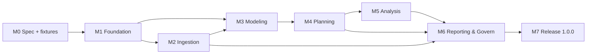

# ROADMAP.md

> OneFP&A · v1.0.0 · **Dependency-ordered milestones. Each: exact features, complexity (S/M/L), docs to reference.** Complexity = engineering estimate relative (S=1–2 wk, M=2–4 wk, L=4–8 wk, per single engineer with CI).

---

## DEPENDENCY GRAPH

## M0 — SPEC & FIXTURES (works in parallel with M1)

| Task | Features/docs | Complexity | Reference docs |
|---|---|---|---|
| Stage 3 + 4 audits close-out | — | S | DOCS-INDEX, FEATURE-TRACEABILITY-MATRIX, DECISIONS |
| Pack schema v1 + 12 pack seeds | F-005 | M | TECH-STACK, PRD F-005, ARCHITECTURE §2 |
| Sample GL dump + Demo Company fixtures | F-004/007 | S | TESTING-STRATEGY §6, QA B8 |
| Bench baseline (perf numbers) | — | S | PERFORMANCE-REQUIREMENTS |

**Exit criteria:** docs:verify green; packs schema-test green; fixtures load in wizard.

## M1 — FOUNDATION (F-001…F-006) · L

**Features:** Company/Workspace Manager · COA & Dimensions · Fiscal Calendar (all presets) · First-Run Wizard · Industry Pack loading + Pack Builder · Horizons/Sizing.
**Docs:** PRD F-001–F-006 · SCREENS-SPEC S-001–S-023 · API-SPEC session/company/coa/calendar/model · DATABASE-SCHEMA §1–5 · AUTH-SPEC §2/3 · SECURITY §2.
**Complexity:** Company S · COA M · Calendar M · Wizard M · Packs M · Security L (merged) — **total L**.
**Exit criteria:** unlock → create company → wizard → calendar preview → grid opens; money/calendar property tests green; a11y gates on 4 screens; migration suite green.

## M2 — INGESTION (F-007…F-011) · L

**Features:** GL Dump/Excel/CSV pipeline · Mapping + templates · Tie-Out gate · Import Batch + rollback + Vault · Reconciliation · Connectors QBO/Xero/NetSuite/Sage.
**Docs:** PRD F-007–F-011 · SCREENS-SPEC S-030–S-034 · API-SPEC import.*/connector.* · DATABASE-SCHEMA §7 · INTEGRATIONS §1–3 · ERROR-HANDLING C/F.
**Complexity:** pipeline M · mapping M · connectors L (4 × M half) — **total L**.
**Exit criteria:** 500k-row fixture imports to cent; tie-out fail/exclude paths E2E; contract tests green; vault + reconciliation proven; Manual Import works with zero connectors (B19 test).

## M3 — MODELING (F-012…F-020) · L

**Features:** Multi-sheet + HyperFormula grid · Formula inspection · Drivers · Assumptions · Methods/Spreading · Headcount · Capital/Debt/WC/13w · Production/Backlog/RevRec · Excel-parity UX.
**Docs:** PRD F-012–F-020 · SCREENS-SPEC S-040–S-048 · API-SPEC model.*/driver.*/assumption.* · DATABASE-SCHEMA §5/6 · STATE-MANAGEMENT §1–3 · CODING-STANDARDS §3/5.
**Complexity:** grid M · inspection S · drivers M · methods M · schedules M · parity M — **total L**.
**Exit criteria:** 1M-cell recalc < 2s; cycle detection E2E; hardcode scan; all five (5 states) on grid sheets; undo 100 steps; perf bench green.

## M4 — PLANNING (F-021…F-023) · M

**Features:** Budget/Forecast/Rolling · Scenario states+versions · Model Compare · What-If/Sensitivity/Goal Seek · Planning Cycle · Input Collection.
**Docs:** PRD F-021–F-023 · SCREENS-SPEC S-050–S-053 · API-SPEC scene.*/plan.* · ERROR-HANDLING E.
**Complexity:** scenarios M · compare S · what-if M · collection M — **total M**.
**Exit criteria:** approve→lock→version immutable; 3-way view; goal seek converge path; collection conflict audit.

## M5 — ANALYSIS (F-024…F-026) · M

**Features:** Variance + Attribution · Reason codes · FVA · Alerts.
**Docs:** PRD F-024–F-026 · SCREENS-SPEC S-054–S-056 · API-SPEC variance.*/fva.*/alerts.* · STATE-MANAGEMENT.
**Complexity:** variance M · attribution M · FVA S · alerts S — **total M**.
**Exit criteria:** attribution honesty (not attributable); FVA ≥3-version empty state; alert dedupe; drill-to-source on every number.

## M6 — REPORTING & GOVERNANCE (F-027…F-033) · L

**Features:** Statement Suite · GAAP/IFRS · Segment · Consolidation (IC/FX/NCI) · Report/KPI Builders · Dashboard/Board Pack · Export suite · Health Check · Audit · Backup/Update.
**Docs:** PRD F-027–F-033 · SCREENS-SPEC S-060–S-076 · API-SPEC statement/consolidation/export/audit/backup · DATABASE-SCHEMA §8/9 · PERFORMANCE §3/4 · SECURITY.
**Complexity:** statements M · consolidation L · builders M · exports M · health/audit M — **total L**.
**Exit criteria:** statement tie + rounding exact with oracle; 2-BU consolidation known-answer; IC unmatched blocks; PDF hash identical 3 OS; data room export.

## M7 — RELEASE 1.0.0 · M

**Tasks:** CI 12-stage (3 OS) · signing/notarization · perf bench + baseline · a11y full sweep · E2E 14 flows × 3 OS · Demo Company QA · rc1 → v1.0.0.
**Docs:** DEPLOYMENT · CI-CD · MONITORING · DEFINITION-OF-DONE · ENV-VARIABLES.
**Exit criteria:** release checklist all green; checksums + SBOM published; v1.0.0 tag signed; CHANGELOG final.

## MILESTONE SUMMARY

| Milestone | Features | Complexity | Target (from spec lock) |
|---|---|---|---|
| M1 Foundation | F-001–F-006 | L | Week 1–6 |
| M2 Ingestion | F-007–F-011 | L | Week 5–12 (parallel w/ M3) |
| M3 Modeling | F-012–F-020 | L | Week 6–16 |
| M4 Planning | F-021–F-023 | M | Week 14–18 |
| M5 Analysis | F-024–F-026 | M | Week 17–21 |
| M6 Reporting/Gov | F-027–F-033 | L | Week 19–30 |
| M7 Release | — | M | Week 28–33 |

**Order policy:** D1→D7 (PRD §6). M2 and M3 may partially parallelize after schema freeze (M0); no feature ships before its QA gates (DEFINITION-OF-DONE).

*Referenced by: TODO.md, DEFINITION-OF-DONE.md, DOCS-INDEX.md.*
