# SCENARIO-VERSION-SPEC.md

> OneFP&A · v1.0.0 · **The exact state machine, versioning, baseline, freeze, and compare semantics for Scenarios (F-021/F-022).** Terms per GLOSSARY.md — Scenario (editable context) ≠ Version (immutable snapshot) ≠ Baseline (the approved Budget reference).

---

## 1. SCENARIO STATE MACHINE (exact)

```mermaid
stateDiagram-v2
    [*] --> Draft
    Draft --> Review: submit (audited)
    Review --> Draft: return (reason required)
    Review --> Approved: approve (audited)
    Approved --> Draft: reopen (reason required)
    Approved --> Locked: lock (creates Version vN; blocks edits)
    Locked --> [*]: (immutable)
    Locked --> Draft: reopen (only if no other version references make it the Baseline — requires ADMIN-equivalent owner + reason; creates a NEW Version on next lock — old Version stays)
    Draft --> [*]: delete (audited, only if no Version references)
```

| Transition | Allowed by | UI surface | Audit |
|---|---|---|---|
| submit | owner | S-050 action | `scenario.submit` |
| approve | owner | S-050 approve | `scenario.approve` |
| lock | owner | S-050 lock → D-004 | `scenario.lock` (writes `scenario_versions` row) |
| reopen (locked) | owner + reason | S-071 waiver-style prompt | `scenario.reopen` |
| delete (draft only) | owner + reason | S-050 | `scenario.delete` |

**Invariant:** a `Locked` Scenario has ≥ 1 Version; `Approved` without Lock is allowed (review gate), but a **Baseline** MUST be Locked (I-something: baseline implies Version). Editing a Locked scenario via grid = `MODEL_CELL_LOCKED` (no silent bypass).

## 2. VERSION SEMANTICS

| Rule | Value |
|---|---|
| Creation triggers | Lock (auto), export-with-stamp (explicit), import that touches the scenario (auto), user "Save Version" (manual, any state) |
| Version number | monotonic per scenario (`v1, v2 …`); never reused |
| Content | full snapshot of Model values + drivers + assumptions + comments referenced for the scenario (row count + checksum) |
| Mutability | none — `scenario_versions` rows are append-only; a restatement creates vN+1, never mutates vN |
| Comparability | two Versions compare iff same Model + same COA version + same horizon (`COMPARE_INCOMPATIBLE` otherwise) |
| Storage | values snapshot in `model_values` (version_id) + driver values; delta-compressed when identical to previous version (V2 optimization, transparent) |
| Retention | all Versions retained for the Company lifetime (archived per FY with audit) |

## 3. BASELINE & COMMIT REFERENCE

- **Baseline** = the Locked Budget Version of the current FY (exactly one per Model/FY; `scenarios.baseline=1`).
- Setting baseline: `approve → lock → mark baseline` (single owner action, audit `baseline.set`; reason required if replacing an existing baseline).
- Baseline **freezes** the Assumption Register entries it used: changing an assumption referenced by a Baseline-derived value → `ASSUMPTION_IN_USE_LOCKED` (create new Version), never silent recompute of a "locked" number.
- Variance's `Commit` column = Baseline; `Budget` column = Budget Scenario (usually the same, may differ if user re-budgets).
- **Hybrid labels** propagate to every Version derived from a Hybrid Model (SCENARIO-VERSION-SPEC §1 + MODELING-METHODS-SPEC §5).

## 4. COMPARE SEMANTICS (S-051, F-022)

| Comparison | Columns | Grouping | Notes |
|---|---|---|---|
| A vs B (2 Scenarios) | value A, value B, Δ, Δ% | by line → sheet → driver | cell-level; formulas shown if authored |
| Version vs Version (same scenario) | vN vs vM | same | immutable diff — the audit trail of model evolution |
| Plan vs Commit vs Actuals (3-Way) | Plan, Commit, Actuals, Δ, Δ% | F-024 3-Way View | columns from GLOSSARY |

Diff rules: Δ computed in Rust (Money Value), Δ% = Δ / |A| (or n/a if A = 0 — never Infinity); filter "only changed" default on for large models; export includes the diff table + metadata (model/scenario/version/hash).

## 5. WHAT-IF & OVERLAY (S-052)

- Overlay: 2–3 Scenarios on one chart (same period scope); each series labeled with scenario + Version stamp (if any).
- Waterfall: Baseline → Driver changes (ordered) → Scenario total; every step maps to a Driver/Assumption delta; a waterfall step with no attributable driver shows "other/manual" and is flagged.
- Sensitivity: one Driver × range from Assumption bounds; tornado bars sorted by absolute impact; `SENSITIVITY_OUT_OF_BOUNDS` if the range exceeds bounds.
- Goal Seek: bounded bisection over one Driver (≤ 100 iterations, tol 1e-9); `GOAL_SEEK_NO_CONVERGE` returns last value + target — never a "converged" false positive.

## 6. AUDIT & FREEZE INTERACTIONS

| Action on Locked state | Behavior |
|---|---|
| Grid edit | `MODEL_CELL_LOCKED`; offer "Create Version" |
| Import touching same scenario | new Version + `import.commit` (never mutates locked) |
| Driver value change | blocked if Driver feeds a Locked line; new Version path |
| Assumption change | `ASSUMPTION_IN_USE_LOCKED` (Baseline refs) |
| Backup/restore of a Company | restores Versions as-is (immutable); restore is a Company-level event, never a scenario transition |
| Export | stamps file with scenario/version metadata (B18-1 traceability) |

*Referenced by: PRD F-021/F-022, SCREENS S-050–S-052, AUTH-SPEC §3, MODELING-METHODS-SPEC.*
